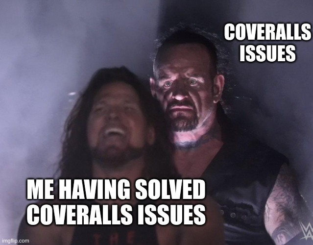
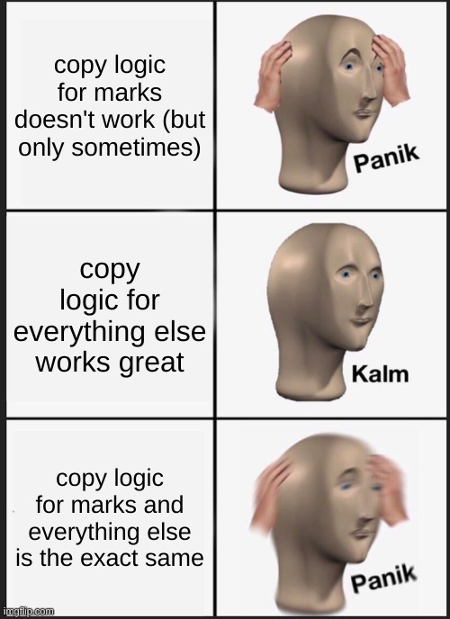

This Week's Task (Big Surprise)
===

<!--pause-->
- Add an option so instructor can preserve grading data when
  recollecting an already collected submission 
<!-- pause -->
<!-- new_line -->
- Do this by `copying over` old grading data

<!-- end_slide -->

What I Did
===

<!-- pause -->
# Writing Test Cases
<!-- pause -->
- Wrote tests for `SubmissionsController`
<!-- pause -->
  - The controller that called the method I modified
<!-- new_line -->
<!-- pause -->
- Wrote Jest tests for two React components:
<!-- pause -->
  - `ManualCollectionForm` in `RepoBrowser`
<!-- pause -->
  - `CollectSubmissionsModal` 
<!-- new_line -->
<!-- pause -->
- Neither had pre-existing tests (lucky me)
<!-- new_line -->
<!-- pause -->
- Found some additional cases to explicitly handle

<!-- pause -->
# Demo: Handling Edge Cases

```bash +exec
brave-browser http://172.17.0.1:3000/csc108/courses/1/assignments/5/submissions/repo_browser?grouping_id=464
```

<!-- end_slide -->
Challenges
===

<!-- pause -->
# Fighting Coveralls
<!-- pause -->



<!-- end_slide -->
Challenges
===

<!-- pause -->
# Flaky Tests
<!-- pause -->
## The Code
```ruby {1-22|4|10|13|15|16|17|19}
# assume a new_result has been created and an old_result exists

result_data = [
  { old: old_result.annotations, new: new_result.annotations },
  { old: old_result.marks, new: new_result.marks },
  { old: old_result.extra_marks, new: new_result.extra_marks }
]

# copy over data from old result to new result
result_data.each do |result_set|
  # get rid of the existing empty records so we can replace them; some results
  # have default models created, so this is necessary
  result_set[:new].destroy_all

  result_set[:old].each do |record|
    record_dup = record.dup
    record_dup.update(result_id: new_result.id)

    add_warning_messages(record_dup.errors.full_messages) if record_dup.errors.present?
  end
end
```
<!-- end_slide -->
Challenges
===

# Flaky Tests
<!-- pause -->
## Sample Tests
<!-- pause -->
```ruby {1-14|3|4-5|11}
context 'for marks' do
    it 'creates the correct number of new marks for each result' do
      @new_results.zip(@original_results).each do |new_result, old_result|
        expect(new_result.marks.size).to eq(old_result.marks.size)
        expect(new_result.marks.ids).not_to eq(old_result.marks.ids)
      end
    end

    it 'retains the correct mark values for each result' do
      @new_results.zip(@original_results).each do |new_result, old_result|
        expect(new_result.marks.map(&:mark)).to eq(old_result.marks.map(&:mark))
      end
    end
end
```

<!-- end_slide -->
Challenges
===

# Flaky Tests
<!-- pause -->

## The Problem
<!-- pause -->


<!-- end_slide -->
Challenges
===

# Flaky Tests
<!-- pause -->

```ruby
it 'retains the correct mark values for each result' do
  @new_results.zip(@original_results).each do |new_result, old_result|
    expect(new_result.marks.map(&:mark)).to eq(old_result.marks.map(&:mark))
  end
end
```
<!-- new_line -->
<!-- pause -->
- 10% of the time: wrong order
<!-- pause -->
  - Expected: `[1.0, 1.0, 0.0]`
<!-- pause -->
  - Actual: `[0.0, 1.0, 1.0]`
<!-- pause -->
  - At this point, thought it could be `order by` clause returning things
    in the wrong order due to create time

<!-- new_line -->
<!-- pause -->
- 1% of the time: wrong numbers
<!-- pause -->
  - Expected: `[0.0, 1.0, 0.0]`
<!-- pause -->
  - Actual: `[0.0, 1.0, 1.0]`
<!-- pause -->
  - Problem: more chances of getting hit by a bus than reproducing this again
<!-- pause -->
  - Maybe a caching issue with `let` vs `let!`
<!-- new_line -->
<!-- pause -->
- Tried a quick fix: change `let` to `let!`
<!-- pause -->
  - No dice

<!-- end_slide -->
Next Week
===
<!-- new_line -->
<!-- pause -->
- Investigate further
<!-- new_line -->
<!-- pause -->
- Maybe ask David
<!-- new_line -->
<!-- pause -->
- PR for realsies this time
<!-- new_line -->
<!-- pause -->
- New task? (lol)

<!-- end_slide -->
The End
===

<!-- jump_to_middle -->

<!-- column_layout: [1, 7, 1] -->
<!-- column: 1 -->
*"A good meme doth speak a thousand words."* - Socrates, probably

