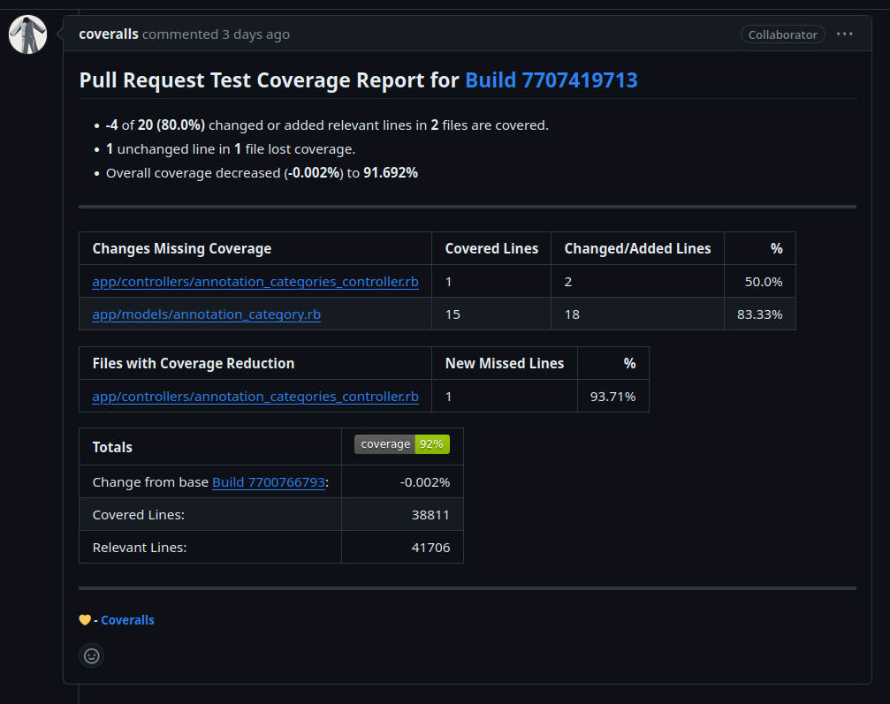
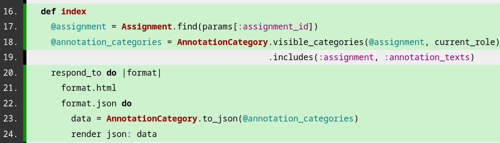

The Tasks
===


<!-- pause -->
1. Fix the *tiny* mistake we made last week (created `to_json` and `to_csv` in the wrong file).
<!-- new_line -->
<!-- pause -->
2. Write tests to satisfy Coveralls and provide `AnnotationCategoriesController#index`'s JSON functionality with coverage.
<!-- new_line -->
<!-- pause -->
3. **New task**: add test coverage for
  `create_or_update_from_csv_row` in `checkbox_criterion.rb`
  and `flexible_criterion.rb`.

<!-- end_slide -->

Task 1: Refactoring the refactor
===

<!-- pause -->
# The Problem

<!-- pause -->

## The Original Task
- `AnnotationCategoriesController#index` method: move the logic that computes
  the JSON representation of annotation categories into a class method of
  `AnnotationCategories` called `to_json`.

<!-- pause -->
## What We Did
- `AnnotationCategoriesController#index` method: moved the logic that computes
  the JSON representation of annotation categories into a class method of
  `AnnotationCategoriesController` called `to_json`.

<!-- end_slide -->

The Wise Words of David 
===

<!-- jump_to_middle -->

> One thing I'll mention is that you should reread my instructions 
> very carefully about the code change you're expected to make, 
> as you seem to have misread something.

<!-- end_slide -->

Task 1: Refactoring the refactor
===

<!-- pause -->

# The Solution

- Aina moved the static methods into the correct class:
  `AnnotationCategory`

<!-- end_slide -->

<!-- jump_to_middle -->

**But, that wasn't it.** 

<!-- end_slide -->

A New Competitor Enters the Ring
===



<!-- end_slide -->

Task 2: Write Tests to Satisfy Coveralls
===

<!-- pause -->
# The Problem

<!-- pause -->
Although we only refactored some code, that code was never
getting tested (on `master` or our branch), and Coveralls did not
like that.

<!-- pause -->
## The Offending Code Snippet
```typescript +line_numbers {1-12|7-10}
def index
    @assignment = Assignment.find(params[:assignment_id])
    @annotation_categories = AnnotationCategory.visible_categories(@assignment, current_role)
                                               .includes(:assignment, :annotation_texts)
    respond_to do |format|
      format.html
      format.json do
        data = AnnotationCategory.to_json(@annotation_categories)
        render json: data
      end
    end
end
```
<!-- end_slide -->
Task 2: Write Tests to Satisfy Coveralls
===
# The Solution

```typescript +line_numbers {1-26|6-10|12-16|18-25}
let(:course) { assignment.course }
let(:assignment) { create(:assignment) }
let(:annotation_category) { create(:annotation_category, assignment: assignment) }

describe '#index' do
  it 'should respond with 200 if json is requested' do
    get_as role,
           :index, params: { course_id: course.id, assignment_id: assignment.id }, format: :json
    expect(response).to have_http_status(200)
  end

  it 'should return the correct number of annotation categories if json is requested' do
    get_as role,
           :index, params: { course_id: course.id, assignment_id: assignment.id }, format: :json
    expect(response.parsed_body.size).to eq(1)
  end

  it 'should return the correct annotation category data if json is requested' do
    get_as role,
           :index, params: { course_id: course.id, assignment_id: assignment.id }, format: :json
    res = response.parsed_body[0]
    first_annotation_category = assignment.annotation_categories.first
    expect(res['annotation_category_name']).to eq first_annotation_category.annotation_category_name
    expect(res['id']).to eq first_annotation_category.id
  end
end
```
<!-- end_slide -->

Task 2: Write Tests to Satisfy Coveralls
===
# Next Steps

```typescript +line_numbers {1-15|11-13|3,6}
let(:course) { assignment.course }
let(:assignment) { create(:assignment) }
let(:annotation_category) { create(:annotation_category, assignment: assignment) }

describe '#index' do
  before { create(:annotation_category, assignment: assignment) }
  it 'should return the correct annotation category data if json is requested' do
    get_as role,
           :index, params: { course_id: course.id, assignment_id: assignment.id }, format: :json
    res = response.parsed_body[0]
    first_annotation_category = assignment.annotation_categories.first
    expect(res['annotation_category_name']).to eq first_annotation_category.annotation_category_name
    expect(res['id']).to eq first_annotation_category.id
  end
end
```

<!-- pause -->

## What We Need To Do

* Figure out how we could make this better and use the existing
  `AnnotationCategory` instead of getting the annotation category manually.

<!-- end_slide -->

New Coverage
===




<!-- end_slide -->

<!-- jump_to_middle -->
Time to merge, right?

<!-- end_slide -->
<!-- jump_to_middle -->
Wrong.

<!-- end_slide -->
Tragedy Strikes
===
# Demo

```bash +exec
cd ~/Programming/Markus && docker-compose run rails bundle exec rspec ./spec/system/main/login_spec.rb
```
<!-- end_slide -->

A New Competitor Enters The Ring
===

# The Problem: Dependency Bumps on `master`

- `12d8155f0` build(deps-dev): bump selenium-webdriver from 4.16.0 to 4.17.0 (#6925)                                                                              
 
- `102532f8d` update changelog with new release v2.4.4 [ci skip] (#6921)                                                                                          
 
- `8b922a21b` Fix bug where graders table failed to load when a group had no members (#6918)                                                                      
 
- `f443ec4d8` build(deps): bump puma from 6. 4.0 to 6.4.2 (#6902)                                                                                                  
 
- `05f72ed38` Allow websocket connections with external auth (#6912)         

<!-- end_slide -->

Task 3: Tests for `create_or_update_from_csv_row`
===

<!-- pause -->
# The Task
> In the test code coverage report, if you go to `app/models`, there are two files in particular I 
want you to look at: `checkbox_criterion.rb` and `flexible_criterion.rb`. Each class has a class 
method called  `create_or_update_from_csv_row`. The red lines (regarding error handling) mean that 
no tests in the test suite are currently triggering those lines. Your tasks are: add new test cases 
for (1) `checkbox_criterion.rb` and (2) `flexible_criterion.rb` to ensure that every line in their 
respective `create_or_update_from_csv_row` method is covered. 

<!-- pause -->
# What I Did
<!-- pause -->
- Found the functions in `flexible_criterion.rb` and `checkbox_criterion.rb`.
<!-- pause -->
- Looked at the Coveralls.
<!-- pause -->
- Split the tasks with Aina.
- That's it.

<!-- end_slide -->
Meme
===


<!-- end_slide -->
<!-- jump_to_middle -->

The End
===
