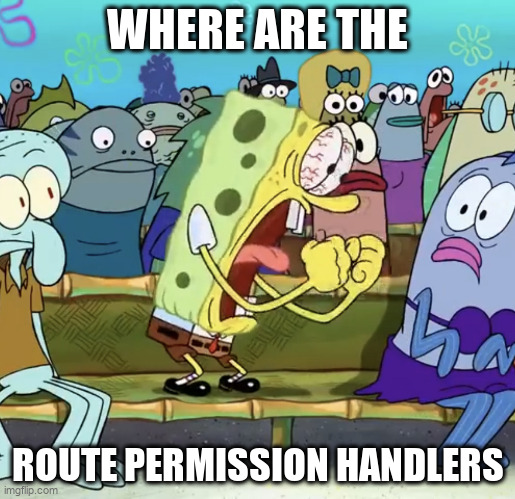

Task 1: Fixing up Last Week's PR
===
<!-- incremental_lists: true -->

# The Easy Problem (+ Solution)
<!-- pause -->
* Had to add some quotes to some descriptions of tests.
    * Old: `"some behaviour on a filetype with extension none"`
    * New: `"some behaviour on a filetype with extension 'none'"`

<!-- pause -->
# The Easy Problem That Turned Out to be Hard

<!-- pause -->
## The Task
<!-- pause -->
Move `flash_csv_result` from `ApplicationHelper` to Markus' `MarkusCsv` library.

<!-- pause -->
## Breaking It Down
<!-- pause -->
* `flash_csv_result`: method that flashes a message about which lines were invalid and valid in a CSV file
* `ApplicationHelper`: a class containing helper methods for the entire application (including the other flash methods)
* `MarkusCsv` library: class that contains CSV related functionality for the entire application 

<!-- end_slide -->

Task 1: Fixing up Last Week's PR
===
<!-- incremental_lists: true -->

## Unexpected Challenge: `flash_message` Method
<!-- pause -->
`flash_csv_result` uses an `ApplicationHelper` function called `flash_message`, which it can't see from MarkusCsv
<!-- pause -->
```ruby
module ApplicationHelper
  # A more robust flash method. Easier to add multiple messages of each type:
  # :error, :success, :warning and :notice
  def flash_message(type, text = '', flash_type = flash, **kwargs)
      ...
  end

  def flash_csv_result(result)
    flash_message(...)
    flash_message(...)
  end
end
```
<!-- end_slide -->

Task 1: Fixing up Last Week's PR
===
<!-- incremental_lists: true -->

## Unexpected Challenge: `flash_message` Method
`flash_csv_result` uses an `ApplicationHelper` function called `flash_message`, which it can't see from MarkusCsv

```ruby
module ApplicationHelper
  # A more robust flash method. Easier to add multiple messages of each type:
  # :error, :success, :warning and :notice
  def flash_message(type, text = '', flash_type = flash, **kwargs)
      ...
  end
end
```

```ruby
class MarkusCsv
  def flash_csv_result(result)
      flash_message(..)
  end
end
```
<!-- pause -->

**Huge Problem:** `flash_message` goes out of scope

<!-- end_slide -->
Task 1: Fixing up Last Week's PR
===

### Potential Solution
Make `flash_message` static:
```ruby {1-7|4}
module ApplicationHelper
  # A more robust flash method. Easier to add multiple messages of each type:
  # :error, :success, :warning and :notice
  def self.flash_message(type, text = '', flash_type = flash, **kwargs)
      ...
  end
end
```

```ruby {1-5|3}
class MarkusCsv
  def flash_csv_result(result)
      ApplicationHelper.flash_message(..)
  end
end
```

<!-- end_slide -->

Task 1: Fixing up Last Week's PR
===

#### Problems With The Solution
```ruby {4}
module ApplicationHelper
  # A more robust flash method. Easier to add multiple messages of each type:
  # :error, :success, :warning and :notice
  def self.flash_message(type, text = '', flash_type = flash, **kwargs)
      ...
  end
end
```

<!-- pause -->

* We have to adjust `157 other instances` of `ApplicationHelper.flash_message` 
<!-- pause -->

<!-- new_line -->
* Calling `ApplicationHelper` destroys the *request context*, making the
  underlying Rails `flash` method go out of scope.
<!-- pause -->
  * `ApplicationHelper.flash_message` supports various flash types and uses
    `flash` even in its function signature, making this hard to circumvent.


<!-- pause -->
# Side Note
<!-- pause -->
* The code block is properly highlighted for once?
<!-- end_slide -->


<!-- end_slide -->
Task 1: Fixing up Last Week's PR
===
<!-- pause -->
### The Chosen Solution
<!-- pause -->
* Give up.

<!-- end_slide -->
Task 2: Letting TAs See Starter Files
===

# The Problem
<!-- pause -->
Students can be assigned various starter files, sometimes even different ones
within the same assignment, but TAs can't see starter files when marking.

<!-- pause -->
## Demo!

<!-- pause -->
# The Wise Words of David
<!-- pause -->

> This should basically be an exercise is reviewing the authorization rules to
> allow TAs to access any routes associated with starter files that are
> read-only, but not allow TAs to modify the starter files or related
> configuration settings.

<!-- pause -->
# Understanding the Problem
<!-- pause -->
First guess: TAs should be able to see starter files from the *result pane*.
<!-- pause -->
* But David's task implied more backend than frontend? This would be quite an operation.

<!-- pause -->
## Demo of Result Pane

<!-- end_slide -->

Task 2: Letting TAs See Starter Files
===

# Conclusion
<!-- pause -->
* Actually, we can just give TAs access to the existing `AssignmentsController#starter_file` route.

<!-- pause -->
## Demo of Starter File Route

<!-- pause -->
# Attempts to Find Route Restrictions 
<!-- pause -->
Searched in various places for restrictions on the routes:
<!-- pause -->

* `routes.rb`
* Individual controllers
* Models
* `session_handler.rb`
* My backyard
* The Ontario Science Center
* Mars.

<!-- pause -->
## Result
<!-- pause -->
Nothing.

<!-- pause -->
## Total Time Wasted
<!-- pause -->
The entire 263 lecture and my commute home.

<!-- end_slide -->

Task 2: Letting TAs See Starter Files
===

# The Eureka Moment

```ruby {1-4}
class SomeRandomController < ApplicationController
  ...
  before_action { authorize! }
  ...
```

<!-- pause -->
Where does this come from? Can't find it in the codebase.
<!-- pause -->

* An **external gem** probably handles it. Time to go through the `Gemfile`.

<!-- pause -->
# ActionPolicy
<!-- pause -->

* Gem that handles authorization as to *who gets to do what*.
<!-- pause -->
<!-- new_line -->
* Allows general management rules but also **per-route tweaking**.
<!-- end_slide -->

<!-- jump_to_middle -->
Code Walk: Policies
===
<!-- end_slide -->

<!-- jump_to_middle -->
Demo: What I Have So Far
===
<!-- end_slide -->
The Two Moods of This Week
===
<!-- column_layout: [1, 1] -->
<!-- column: 0 -->

<!-- column: 1 -->

<!-- end_slide -->
<!-- jump_to_middle -->
The End!
===
