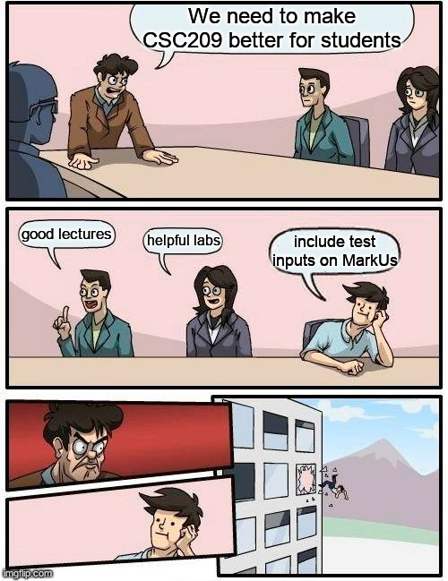

Overview
===

# The Problem

<!-- pause -->

- MarkUs supports different `starter file groups` for different students
<!-- new_line -->
<!-- pause -->
- TAs cannot currently see starter file groups or `who was assigned what` starter files.
<!-- pause -->

# Last Week
<!-- pause -->
* Fix permissions so TAs can `see starter files page`.
<!-- new_line -->
<!-- pause -->
* We _already keep track_ of who downloaded what starter files. 
<!-- pause -->
  * Changed permissions so TAs could `download these starter file mappings`

<!-- pause -->
# This Week
<!-- pause -->
* Make the user experience good (front-end changes!)

<!-- end_slide -->

<!-- jump_to_middle -->
Demo: do we HAVE to care about the user's experience?
===

<!-- pause -->
I mean really, what are *they* doing?
===

<!-- end_slide -->

The Solution
===

<!-- pause -->
# The Ramblings of Pranav

<!-- new_line -->
<!-- pause -->
* I know I want to make a change to the `state` or `props` of the React
  component associated with the starter file page.
<!-- new_line -->
<!-- pause -->
* Looking in the associated file:

```javascript
  constructor(props) {
    super(props);
    this.state = {
        ...
    };
  }
```

<!-- new_line -->
<!-- pause -->
* Cool, but where do we set this state for the first time?
  * i.e. where do we `ask the server` for information to put in this state?

<!-- end_slide -->
The Solution
===

# The Ramblings of Pranav (Ctd.)
<!-- pause -->
* We `populate the state` for the first time here:

```javascript
  componentDidMount() {
    this.fetchData();
  }
```

```javascript {1-10|3,9}
  fetchData = () => {k
    fetch(
      Routes.populate_starter_file_manager_course_assignment_path(
          ...
      ),
    ...
    )
      ...
      .then(res => this.setState({loading: false, ...res}));
  };
```
<!-- end_slide -->

The Solution
===

# My Understanding, Summarized
<!-- pause -->
<!-- new_line -->
1. Component `mounts`
<!-- new_line -->
<!-- pause -->
2. Component `asks server for information` to store in state
<!-- new_line -->
<!-- pause -->
3. `Server retrieves information` and sends it back
<!-- new_line -->
<!-- pause -->
4. `Component stores information` in state
<!-- new_line -->
<!-- pause -->
5. We can use the state to `manipulate the DOM`

<!-- end_slide -->
The Solution
===

# Phase 1: Add Attribute to State
<!-- pause -->
* Add a `readOnly` attribute to the state that determines if this page is in "read only mode"

```javascript
    this.state = {
      ...
      readOnly: true,
      ...
    };
```
<!-- pause -->

# Phase 2: Coerce Server Into Giving Us Extra Info
* Make the server give us extra information so when we call `fetchData()` in
  the frontend, it also fetches if the user should have the page as `readOnly`
  or not

```ruby
def populate_starter_file_manager
    ...
    data = { # <other data we're giving to the frontend>
             readOnly: !(current_role.instructor? || current_role.grader_permission.manage_submissions) }
    render json: data
end
```

<!-- pause -->
In essence:
* Instructors are never read-only
* TAs are read only depending on `grader permissions` that can vary

<!-- end_slide -->
The Solution
===

# Phase 3: Use `readOnly` Attribute to Disable Components

* **Example:** if a user is readOnly, they should not be able to click the delete button

```javascript {1-8|5}
<button
    key={"delete_starter_file_group_button"}
    className={"button"}
    onClick={() => this.deleteStarterFileGroup(id)}
    disabled={this.state.readOnly}
    >
    <FontAwesomeIcon icon="fa-solid fa-trash" />
</button>
```

<!-- pause -->
* **Note:** `readOnly` never changes no matter how many times we get it from
  the server

<!-- pause -->
# Phase 4: Profit
<!-- pause -->
* Demo!

```bash +exec
cd $HOME/Programming/Markus/sandbox-tas-see-starter-files && git reset --hard feat/tas-see-starter-files
```

<!-- end_slide -->

The Solution
===
# Epilogue: The Fable of the Lost TA
<!-- pause -->

## The Problem
<!-- pause -->
* So far, I have been going to the `starter_file` route manually
<!-- pause -->
<!-- new_line -->
* How will the TAs get to this page in the first place?

## My Solution
<!-- pause -->
<!-- new_line -->
* Add "Starter File" tab to the TA's summary page
<!-- pause -->
<!-- new_line -->
* Demo!

<!-- end_slide -->
Life Too Extreme? Make It A Meme!
===


